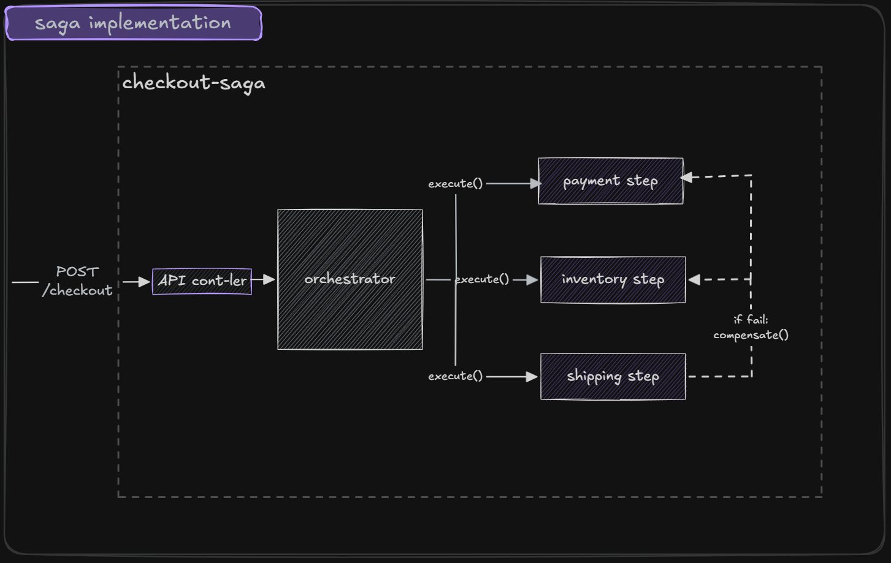

# Checkout Saga Pattern (Node.js + TypeScript)

This project demonstrates an implementation of the Saga Pattern using an orchestration-based approach inside a single microservice.

## Overview

The checkout workflow contains three steps:

1. Payment
2. Inventory
3. Shipping

Each step supports:

- execute() — forward transaction
- compensate() — rollback action

If any step fails, previously completed steps are compensated in reverse order to maintain consistency.

## Architecture

Controller → Saga Orchestrator → Steps

The SagaOrchestrator coordinates execution and handles rollback logic.



## Running the project

Install dependencies:

```bash
npm install
```

Run in development:

```bash
npm run dev
```

Build:

```bash
npm run build
```

Start production:

```bash
npm start
```

Server runs on: <http://localhost:3000>

## API

`POST` `/checkout`

Example request:

```json
{
  "orderId": "1",
  "userId": "user1",
  "amount": 100,
  "items": ["item1"],
  "address": "Street 1"
}
```

## Failure Simulation

You can simulate failures:

```json
{
  "failPayment": true
}
```

```json
{
  "failInventory": true
}
```

```json
{
  "failShipping": true
}
```
